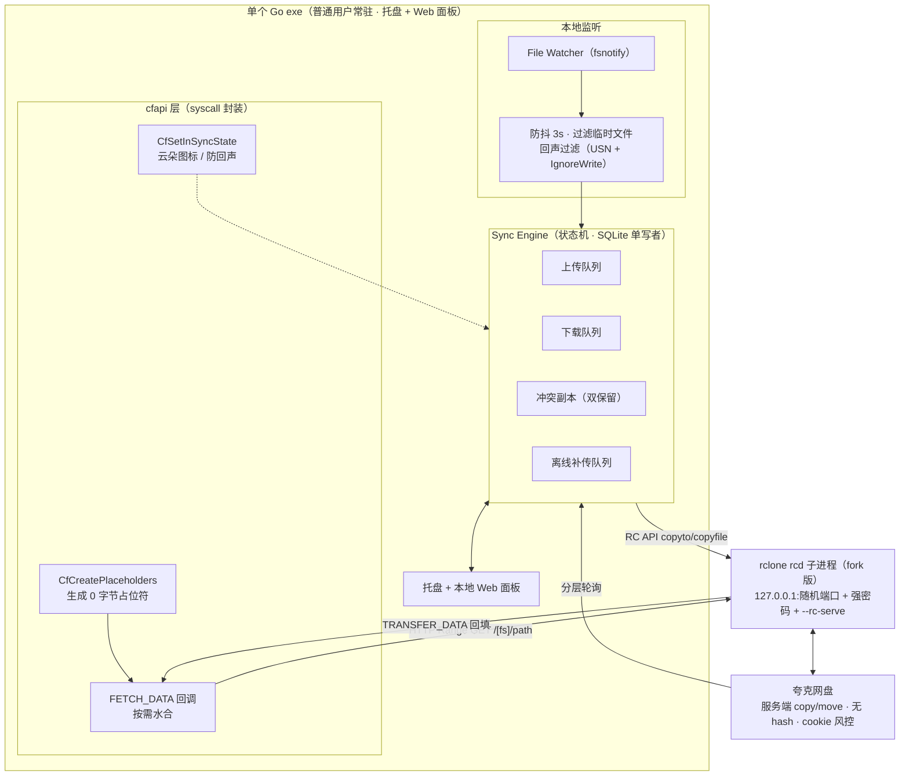

# Onerclone —— 需求与进度记录

> 更新时间：2026-09-24 · 状态：**Phase 0（Spike）进行中，因故暂停，恢复工作见 §7**

---

## 1. 项目愿景

做一个类似 OneDrive 体验的夸克网盘 Windows 客户端（单个 Go exe）：

- 本地实体目录 + 0 字节占位符文件 + 资源管理器**云朵图标**
- 打开文件时**按需水合**（从云端拉数据）
- **断网可用**：目录树永远可见，已水合文件离线正常读写，未水合文件快速报错不卡死
- 本地改动**防抖后静默上传**，离线改动联网自动补传
- 双向同步 + 冲突副本，多台电脑共用同一账号最终一致

**核心验收故事**：第一天在同步目录修改 `1.doc`，第二天出差断网，`od/1.doc` 还在、且是修改后的版本，可正常打开。（反例基线：纯 `rclone mount` 断网整个目录消失。）

---

## 2. 需求清单（已与用户对齐）

### 功能需求（FR）

| # | 需求 | 精确表述 |
|---|---|---|
| FR1 | 虚拟占位符 | rclone 拉云端目录树 → `CfCreatePlaceholders`（**cfapi.h**，非 cldflt.h）生成 0 字节占位符；云朵图标 = 占位符 + **in-sync** + 未水合（漏设 in-sync 显示双向箭头） |
| FR2 | 按需水合 | `CF_CALLBACK_TYPE_FETCH_DATA` → 经 rclone 取流 → `CfExecute(CF_OPERATION_TYPE_TRANSFER_DATA)` 回填（4KB 对齐） |
| FR3 | 离线高可用 | 目录树离线可见；已水合文件离线读写；**未水合文件离线 = 回调立即返回 `STATUS_CLOUD_FILE_NETWORK_UNAVAILABLE`(0xC000CF11) → 用户 I/O 立即失败不卡死**（回调不响应 = 固定 60s 超时） |
| FR4 | 监听+防抖 | fsnotify 监听同步根；句柄释放 + 3s 无新事件才结算；过滤 `~$`/`.tmp`；稳定后入上传队列 → rclone `operations/copyfile`（经 RC API） |
| FR5 | 离线补传 | 离线修改持久化队列，联网自动重放 |

### 衍生需求（DR）

- **DR1 回声防护**：创建占位符产生 USN；`IgnoreWrite` 标记 + USN 比对 + `CfSetInSyncState(InSyncUsn)`。**实测补充：水合写入零 watcher 事件，比预期干净**
- **DR2 删除基线保护**：首次全量扫描建立基线前，禁止任何删除和覆盖上传
- **DR3 全回调实现**：注册了的回调必须响应（否则 60s 超时）
- **DR4 登录闭环**：扫码登录 → cookie 加密落盘 → 过期 UI 提示重新扫码
- **DR5 Sync Root 生命周期**：注册/注销/崩溃残留清理
- **DR6 磁盘缓冲**：夸克上传必须全量落盘临时文件，预留最大单文件空间
- **DR7 进程模型**：常驻 Daemon；cfapi 回调来自线程池、**并发重入**，必须加锁

### 非目标 / 约束（v1）

- 仅 **Windows 10 1709+**、仅 **NTFS**（ReFS/exFAT/FAT32 不支持）
- 单 Sync Root（如 `C:\Users\<你>\Onerclone`）
- 不做内核驱动、不做多云聚合

### 待真机验证的开放事实

1. ~~非管理员能否 CfRegisterSyncRoot~~ → **✅ 已回答：普通用户即可，无需 UAC**
2. 离线快速失败的实际弹窗表现 → **✅ 已验证：9~12ms 报“网络不可用”，不卡死**（记事本/PS 已测，Office/资源管理器待测）
3. Go 封装 cfapi 全链路 → **✅ 已打通**（见 §6）

---

## 3. 已锁定的 19 个决策

| # | 决策 | 结论 |
|---|---|---|
| Q1 | 需求基线 | FR1–FR5 + DR1–DR7 确认；未水合离线 = 快速报错（OneDrive 同款） |
| Q2 | 语言 | **Go** |
| Q3 | 数据规模 | 按 10 万文件 / 单文件 50GB 设计 |
| Q4 | 同步根与删除 | 单同步根（仅 NTFS）；本地删除 → 云端删除（回收站），受 DR2 保护 |
| Q5 | 缓存脱水 | 用户手动管理；**有未上传修改的文件禁止脱水** |
| Q6 | 云端变更落地 | 曾水合/PINNED 的联网自动重新下载；新文件只建占位符 |
| Q7 | 冲突 | **冲突副本双保留**（`1 (冲突 20260924).doc`），size+mtime 判定 |
| Q8/Q14 | UI | 托盘（systray）+ 本地 Web 面板（go:embed 单页，一次性 token）；承载队列/冲突/扫码/脱水管理 |
| Q9 | fork 姿态 | 钉死本 fork 版本；PR #9662 合并上游后切官方（rclone 版本可配置留后门） |
| Q10/Q17 | 多机 | 一账号多电脑，**对称双活**，冲突副本兜底 |
| Q11/Q19 | 提权打包 | **实测普通用户可注册（连 UAC 都不用）**；MVP 单文件绿色版，后续套 Inno |
| Q12 | rclone 集成 | **子进程 `rclone rcd`**（cookie/config 归属 + 崩溃隔离）；127.0.0.1 随机高位端口 + 随机强凭据 |
| Q13 | 状态库 | **SQLite**（modernc 纯 Go，WAL，单写者=Engine） |
| Q15 | 云端发现 | 自适应分层轮询（活跃 30–60s / 空闲 5min / 唤醒·联网·手动强制扫）+ 12h 全量对账兜底 |
| Q16 | 重试 | 分类退避：网络类指数退避无限重试（封顶 5min+抖动）；429/风控大幅降速；cookie 过期 → 停队列 + 扫码提醒 |
| Q18 | 删除 vs 冲突 | **冲突优先**：有分歧一律双保留，宁复活不删除 |

---

## 4. 架构定稿



---

## 5. 关键事实（调研结论，别再踩）

### 5.1 fork 分支（zly2006/rclone @ agent/quark-backend）

- 基于 rclone v1.75，改动全在 `backend/quark/`，**core（fs/rc/cmd/vfs）零改动 → RC API 完整可用**；draft PR #9662，7 周无提交
- **对外无 Hash**（只能 size+mtime 比对）；**不能改已存在远端文件 mtime**
- 上传前必须**全量落盘临时文件**算 hash（秒传用）；登录 = 终端扫码 → cookie 滚动刷新（60s 节流写回配置）→ **会过期需重扫**
- 删除 = 进回收站；Copy/Move 服务端操作；文件名有 Unicode 规范化限制
- 用户本机实编译版：**`D:\Tools\rclone\rclone.exe`（v1.70.0-quark，含 quark backend + rc）**

### 5.2 Windows Cloud Files API（cfapi.h / CldApi.dll）

- 最低 Win10 **1709**、**仅 NTFS**；头文件是 **cfapi.h**（不是 cldflt.h）
- `CfCreatePlaceholders` / `CfExecute`(TRANSFER_DATA) / `CfSetInSyncState(handle, state, flags, *usn)` 全部确认存在
- **`FileIdentity` 对文件是必填字段**（漏了报 `0x8007017C` = STATUS_CLOUD_FILE_NOT_SUPPORTED）
- 回调固定 **60s 超时**；回调立即回失败 → 用户 I/O **立即失败**；错误码用 `STATUS_CLOUD_FILE_NETWORK_UNAVAILABLE`(0xC000CF11)（`CF_E_NETWORK_FAILURE` 不存在）
- `NormalizedPath` 是**卷内路径**（`\Users\...`），盘符要从 `VolumeDosName` 拼
- **Population 必须用 `ALWAYS_FULL`(3)**（微软 CloudMirror 示例同款）——PARTIAL 会让每次路径解析/枚举触发 `FETCH_PLACEHOLDERS`，应答不当 = 回调风暴（实测 3500 次/秒）+ 枚举 60s 超时 + 新建文件 `ERROR_INVALID_NAME`
- 云朵图标条件：placeholder + in-sync + 未水合；水合写入**不产生** watcher 事件（实测）
- 注册表 HKLM\...\SyncRootManager；**实测普通用户注册成功（elevated=false）**
- 参考实现：微软 CloudMirror（`Samples/CloudMirror/CloudMirror/`，回调表只注册 FETCH_DATA + CANCEL）

### 5.3 rclone RC

- **没有 `operations/cat`/`operations/open` 等直读内容的 RC 方法**（官方方法全表核实）
- **水合数据通道 = `--rc-serve` + HTTP GET `/[<fs>]/<remote>` + Range 头**（fs 放**方括号**里，源码 `fsMatch` 正则 `^\[(.*?)\](.*)$`；206 精确区间已实测 ✅）
- RC 请求体必须是 JSON（无参数也要发 `{}`）
- 上传 = `operations/copyfile`；列举 = `operations/list`（`Path` 字段 = 相对远程根路径）

### 5.4 aliyunpan（tickstep）调研结论

- **没有虚拟盘/挂载**，纯 CLI 轮询同步器（全量扫描 → diff → 传），与我们方案不同路
- **值得借鉴（Phase 1 抄）**：三库状态模型（本地快照/云端快照/动作队列 bolt）、入队幂等与频控（成功 1 分钟冷却、失败分层冷却、进行中去重）、上传前复查 mtime、**拔盘误删保护（本地根消失宁可停机也不执行删除）**、列表接口 1.5s 风控节流、size+mtime 未变复用哈希捷径
- 它的双向同步是 TODO 半成品；冲突无真解（单向覆盖）

---

## 6. 当前进度（Phase 0 Spike）

### 代码结构

```
Onerclone/
├── go.mod                    module onerclone（Go 1.27.1）
├── reference/cfapi.h         Windows SDK 10.0.16299 头文件（移植蓝本）
├── internal/
│   ├── cfapi/                Cloud Files API 的 Go syscall 绑定
│   │   ├── types.go          结构体/枚举（x64 布局逐字段对照头文件核验）
│   │   └── cfapi.go          注册/连接/回调桩/TRANSFER_DATA/占位符创建/in-sync
│   └── rclone/
│       ├── rc.go             RC 客户端（List/RangeGet/CopyFile/Version）
│       └── daemon.go         rclone rcd 子进程管理（启动/就绪探测/Exited 监控）
└── cmd/spike/                Spike 验证程序（register / run / unregister 子命令）
    └── main.go               占位符初始化 + FETCH_DATA 水合 + watcher 防抖上传
```

### 环境（本机）

- Go：`D:\0Project\Go\bin\go.exe`（已加入用户 PATH）
- rclone：`D:\Tools\rclone\rclone.exe`（v1.70.0-quark）
- 同步根：`C:\Users\Jw\OnercloneSpike`（已注册）
- 云端替身（spike 测试用 local 后端）：`D:\0Project\0repos\Onerclone\spike-remote`
- 日志：`spike.log`（控制台 + 文件双写）

### 运行手册

```powershell
cd D:\0Project\0repos\Onerclone
$env:Path += ';D:\0Project\Go\bin'

.\spike.exe register            # 注册同步根（普通用户即可）
.\spike.exe run                 # 启动（在线模式）
.\spike.exe run -offline        # 离线模式（水合立即快速失败）
.\spike.exe unregister          # 注销同步根
```

### ✅ 已验证通过（Phase 0 成果）

| # | 验证项 | 结果 |
|---|---|---|
| 1 | 普通用户注册同步根 | ✅ elevated=false 注册成功，**无需 UAC** |
| 2 | 占位符批量创建 | ✅ 3 文件 7ms（FileIdentity 必填坑已过） |
| 3 | **水合全链路** | ✅ FETCH_DATA → rc-serve Range(206) → TRANSFER_DATA 回填；hello 2ms / 8MB 21ms / 嵌套 1ms，字节级正确 |
| 4 | 离线快速失败 | ✅ 9~12ms 报“网络不可用”，不卡死（开放事实②） |
| 5 | Population=ALWAYS_FULL | ✅ 枚举 60s 超时 → **0ms**；新建文件/目录 INVALID_NAME → **OK**；回调风暴消失 |
| 6 | 水合零回声 | ✅ 水合写入不产生 watcher 事件（DR1 事实） |
| 7 | 事件监听 + 防抖 | ✅ raw 事件 → 入队（脏计数）→ 3s 后 AfterFunc 结算 → 触发上传 |
| 8 | 心跳/日志探针 | ✅ 30s 心跳正常，watcher 存活可证 |

### ⚠️ 当前卡点（恢复工作从这里开始）

1. **`cmd/spike/main.go:538` 语法错误未修**（上次编辑插入错位，orphan 语句在函数外）：
   - 症状：`syntax error: non-declaration statement outside function body`
   - 修法：把函数外的孤立行 `	log.Printf("▶ onSettled 入口 %s", base)` 移进 `func onSettled` 内（`base := filepath.Base(path)` 之后），函数外只留注释和函数头
2. **rclone rcd 子进程约 20 秒后死掉**（上传时报 `connection refused`）：
   - 已加 `Exited chan` + 后台 `cmd.Wait()` 收割 + main 里监控 goroutine（死时打印 rcd 输出）→ **修完语法错误跑一次即知根因**
3. **结算批次只处理第 1 项就没下文**（brand-new 尝试上传后，hello.txt 的 ⬆ 日志缺失）：
   - 已加 `▶ 结算开始/已处理/完成` 和 `▶ onSettled 入口` 探针 → 同上，跑一次即知卡在哪

### Phase 0 剩余验收

- [ ] 修语法错误 → 重跑，拿到 2/3 的根因
- [ ] 上传链路走通：本地修改 → copyfile → 云端替身内容一致 + in-sync 标记
- [ ] 离线模式下用记事本/资源管理器实测弹窗表现（开放事实②收尾）
- [ ] 资源管理器肉眼确认云朵图标（FR1 图标条件：in-sync + 未水合）
- [ ] （可选顺带）目录列举按 mtime 增量的可行性（Q15c）

---

## 7. 恢复工作清单（回家接着干）

1. 修 `main.go:538` 语法错误（§6 卡点1）
2. `go build && go vet` → `.\spike.exe run` → 跑测试序列：
   ```powershell
   [IO.File]::WriteAllText('C:\Users\Jw\OnercloneSpike\brand-new.txt','hello')
   Add-Content 'C:\Users\Jw\OnercloneSpike\hello.txt' 'ROUND4'
   Start-Sleep 6
   Get-Content .\spike.log   # 看 rcd 死因 + 结算探针 + 上传结果
   ```
3. 依根因修复：rdc 保活（必要时加自动重启）→ 结算批次 bug
4. 上传验证通过后 = **Phase 0 全部完成** → 进入 Phase 1（见下）

## 8. 后续 Phase 划分

- **Phase 0（Spike）**：§6/§7，目标全链路 + 3 个开放事实全绿
- **Phase 1（MVP）**：SQLite 状态库（抄 aliyunpan 三库模型）、云端轮询落地（Q6 语义）、删除同步（DR2 基线保护）、断网/补传、分类重试队列、回声过滤打磨、接入真实夸克 remote（扫码登录 DR4）
- **Phase 2**：托盘 + Web 面板（队列/冲突/扫码/脱水管理）、冲突副本可视化
- **Phase 3**：打包（Inno）、开机自启、双机实测、10 万文件性能压测
