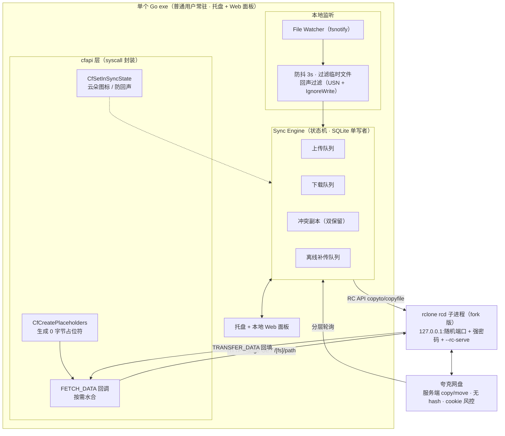

# Onerclone —— 需求与进度记录

> 更新时间：2026-09-25 · 状态：**Phase 1（MVP）核心完成**：三库状态库 + 双向同步引擎 + 集成测试 A–E 全过；剩余夸克真实接入（DR4 扫码）

---

## 0. 环境变更（2026-09-25，新机器/新路径）

- Go：`D:\Software\go\bin\go.exe`（v1.27.1，已加入用户 PATH；官方 zip 解压安装）
- rclone：`D:\Software\rclone\rclone.exe`（**v1.70.0-quark**，含 quark backend + rc ✓）
- 仓库：`D:\0Code\Onerclone`
- spike 默认 `-rclone` flag 已改为新路径

---

## 1. 项目愿景

做一个类似 OneDrive 体验的夸克网盘 Windows 客户端（单个 Go exe）：

- 本地实体目录 + 0 字节占位符文件 + 资源管理器**云朵图标**
- 打开文件时**按需水合**（从云端拉数据）
- **断网可用**：目录树永远可见，已水合文件离线正常读写，未水合文件快速报错不卡死
- 本地改动**防抖后静默上传**，离线改动联网自动补传
- 双向同步 + 冲突副本，多台电脑共用同一账号最终一致

**核心验收故事**：第一天在同步目录修改 `1.doc`，第二天出差断网，`od/1.doc` 还在、且是修改后的版本，可正常打开。（反例基线：纯 `rclone mount` 断网整个目录消失。）

---

## 2. 需求清单（已与用户对齐）

### 功能需求（FR）

| # | 需求 | 精确表述 |
|---|---|---|
| FR1 | 虚拟占位符 | rclone 拉云端目录树 → `CfCreatePlaceholders`（**cfapi.h**，非 cldflt.h）生成 0 字节占位符；云朵图标 = 占位符 + **in-sync** + 未水合（漏设 in-sync 显示双向箭头） |
| FR2 | 按需水合 | `CF_CALLBACK_TYPE_FETCH_DATA` → 经 rclone 取流 → `CfExecute(CF_OPERATION_TYPE_TRANSFER_DATA)` 回填（4KB 对齐） |
| FR3 | 离线高可用 | 目录树离线可见；已水合文件离线读写；**未水合文件离线 = 回调立即返回 `STATUS_CLOUD_FILE_NETWORK_UNAVAILABLE`(0xC000CF11) → 用户 I/O 立即失败不卡死**（回调不响应 = 固定 60s 超时） |
| FR4 | 监听+防抖 | fsnotify 监听同步根；句柄释放 + 3s 无新事件才结算；过滤 `~$`/`.tmp`；稳定后入上传队列 → rclone `operations/copyfile`（经 RC API） |
| FR5 | 离线补传 | 离线修改持久化队列，联网自动重放 |

### 衍生需求（DR）

- **DR1 回声防护**：创建占位符产生 USN；`IgnoreWrite` 标记 + USN 比对 + `CfSetInSyncState(InSyncUsn)`。**实测补充：水合写入零 watcher 事件，比预期干净**
- **DR2 删除基线保护**：首次全量扫描建立基线前，禁止任何删除和覆盖上传
- **DR3 全回调实现**：注册了的回调必须响应（否则 60s 超时）
- **DR4 登录闭环**：扫码登录 → cookie 加密落盘 → 过期 UI 提示重新扫码
- **DR5 Sync Root 生命周期**：注册/注销/崩溃残留清理
- **DR6 磁盘缓冲**：夸克上传必须全量落盘临时文件，预留最大单文件空间
- **DR7 进程模型**：常驻 Daemon；cfapi 回调来自线程池、**并发重入**，必须加锁

### 非目标 / 约束（v1）

- 仅 **Windows 10 1709+**、仅 **NTFS**（ReFS/exFAT/FAT32 不支持）
- 单 Sync Root（如 `C:\Users\<你>\Onerclone`）
- 不做内核驱动、不做多云聚合

### 待真机验证的开放事实

1. ~~非管理员能否 CfRegisterSyncRoot~~ → **✅ 已回答：普通用户即可，无需 UAC**
2. 离线快速失败的实际弹窗表现 → **✅ 已验证：9~12ms 报“网络不可用”，不卡死**（记事本/PS 已测，Office/资源管理器待测）
3. Go 封装 cfapi 全链路 → **✅ 已打通**（见 §6）

---

## 3. 已锁定的 19 个决策

| # | 决策 | 结论 |
|---|---|---|
| Q1 | 需求基线 | FR1–FR5 + DR1–DR7 确认；未水合离线 = 快速报错（OneDrive 同款） |
| Q2 | 语言 | **Go** |
| Q3 | 数据规模 | 按 10 万文件 / 单文件 50GB 设计 |
| Q4 | 同步根与删除 | 单同步根（仅 NTFS）；本地删除 → 云端删除（回收站），受 DR2 保护 |
| Q5 | 缓存脱水 | 用户手动管理；**有未上传修改的文件禁止脱水** |
| Q6 | 云端变更落地 | 曾水合/PINNED 的联网自动重新下载；新文件只建占位符 |
| Q7 | 冲突 | **冲突副本双保留**（`1 (冲突 20260924).doc`），size+mtime 判定 |
| Q8/Q14 | UI | 托盘（systray）+ 本地 Web 面板（go:embed 单页，一次性 token）；承载队列/冲突/扫码/脱水管理 |
| Q9 | fork 姿态 | 钉死本 fork 版本；PR #9662 合并上游后切官方（rclone 版本可配置留后门） |
| Q10/Q17 | 多机 | 一账号多电脑，**对称双活**，冲突副本兜底 |
| Q11/Q19 | 提权打包 | **实测普通用户可注册（连 UAC 都不用）**；MVP 单文件绿色版，后续套 Inno |
| Q12 | rclone 集成 | **子进程 `rclone rcd`**（cookie/config 归属 + 崩溃隔离）；127.0.0.1 随机高位端口 + 随机强凭据 |
| Q13 | 状态库 | **SQLite**（modernc 纯 Go，WAL，单写者=Engine） |
| Q15 | 云端发现 | 自适应分层轮询（活跃 30–60s / 空闲 5min / 唤醒·联网·手动强制扫）+ 12h 全量对账兜底 |
| Q16 | 重试 | 分类退避：网络类指数退避无限重试（封顶 5min+抖动）；429/风控大幅降速；cookie 过期 → 停队列 + 扫码提醒 |
| Q18 | 删除 vs 冲突 | **冲突优先**：有分歧一律双保留，宁复活不删除 |

---

## 4. 架构定稿


```mermaid
flowchart TB
    subgraph EXE["单个 Go exe（普通用户常驻 · 托盘 + Web 面板）"]
        subgraph CFAPI["cfapi 层（syscall 封装）"]
            PH["CfCreatePlaceholders<br/>生成 0 字节占位符"]
            FD["FETCH_DATA 回调<br/>按需水合"]
            IS["CfSetInSyncState<br/>云朵图标 / 防回声"]
        end
        subgraph WATCH["本地监听"]
            FW["File Watcher（fsnotify）"]
            DB["防抖 3s · 过滤临时文件<br/>回声过滤（USN + IgnoreWrite）"]
        end
        subgraph CORE["Sync Engine（状态机 · SQLite 单写者）"]
            Q1Q["上传队列"]
            Q2Q["下载队列"]
            Q3Q["冲突副本（双保留）"]
            Q4Q["离线补传队列"]
        end
        UI["托盘 + 本地 Web 面板"]
    end
    RC["rclone rcd 子进程（fork 版）<br/>127.0.0.1:随机端口 + 强密码 + --rc-serve"]
    QD["夸克网盘<br/>服务端 copy/move · 无 hash · cookie 风控"]

    FW --> DB --> CORE
    PH --> FD
    FD -->|"HTTP Range GET /[fs]/path"| RC
    RC -->|"TRANSFER_DATA 回填"| FD
    IS -.-> CORE
    CORE -->|"RC API copyto/copyfile"| RC
    RC <--> QD
    QD -->|"分层轮询"| CORE
    CORE <--> UI
```

---

## 5. 关键事实（调研结论，别再踩）

### 5.1 fork 分支（zly2006/rclone @ agent/quark-backend）

- 基于 rclone v1.75，改动全在 `backend/quark/`，**core（fs/rc/cmd/vfs）零改动 → RC API 完整可用**；draft PR #9662，7 周无提交
- **对外无 Hash**（只能 size+mtime 比对）；**不能改已存在远端文件 mtime**
- 上传前必须**全量落盘临时文件**算 hash（秒传用）；登录 = 终端扫码 → cookie 滚动刷新（60s 节流写回配置）→ **会过期需重扫**
- 删除 = 进回收站；Copy/Move 服务端操作；文件名有 Unicode 规范化限制
- 用户本机实编译版：**`D:\Tools\rclone\rclone.exe`（v1.70.0-quark，含 quark backend + rc）**

### 5.2 Windows Cloud Files API（cfapi.h / CldApi.dll）

- 最低 Win10 **1709**、**仅 NTFS**；头文件是 **cfapi.h**（不是 cldflt.h）
- `CfCreatePlaceholders` / `CfExecute`(TRANSFER_DATA) / `CfSetInSyncState(handle, state, flags, *usn)` 全部确认存在
- **`FileIdentity` 对文件是必填字段**（漏了报 `0x8007017C` = STATUS_CLOUD_FILE_NOT_SUPPORTED）
- 回调固定 **60s 超时**；回调立即回失败 → 用户 I/O **立即失败**；错误码用 `STATUS_CLOUD_FILE_NETWORK_UNAVAILABLE`(0xC000CF11)（`CF_E_NETWORK_FAILURE` 不存在）
- `NormalizedPath` 是**卷内路径**（`\Users\...`），盘符要从 `VolumeDosName` 拼
- **Population 必须用 `ALWAYS_FULL`(3)**（微软 CloudMirror 示例同款）——PARTIAL 会让每次路径解析/枚举触发 `FETCH_PLACEHOLDERS`，应答不当 = 回调风暴（实测 3500 次/秒）+ 枚举 60s 超时 + 新建文件 `ERROR_INVALID_NAME`
- 云朵图标条件：placeholder + in-sync + 未水合；水合写入**不产生** watcher 事件（实测）
- 注册表 HKLM\...\SyncRootManager；**实测普通用户注册成功（elevated=false）**
- 参考实现：微软 CloudMirror（`Samples/CloudMirror/CloudMirror/`，回调表只注册 FETCH_DATA + CANCEL）

### 5.3 rclone RC

- **没有 `operations/cat`/`operations/open` 等直读内容的 RC 方法**（官方方法全表核实）
- **水合数据通道 = `--rc-serve` + HTTP GET `/[<fs>]/<remote>` + Range 头**（fs 放**方括号**里，源码 `fsMatch` 正则 `^\[(.*?)\](.*)$`；206 精确区间已实测 ✅）
- RC 请求体必须是 JSON（无参数也要发 `{}`）
- 上传 = `operations/copyfile`；列举 = `operations/list`（`Path` 字段 = 相对远程根路径）

### 5.4 aliyunpan（tickstep）调研结论

- **没有虚拟盘/挂载**，纯 CLI 轮询同步器（全量扫描 → diff → 传），与我们方案不同路
- **值得借鉴（Phase 1 抄）**：三库状态模型（本地快照/云端快照/动作队列 bolt）、入队幂等与频控（成功 1 分钟冷却、失败分层冷却、进行中去重）、上传前复查 mtime、**拔盘误删保护（本地根消失宁可停机也不执行删除）**、列表接口 1.5s 风控节流、size+mtime 未变复用哈希捷径
- 它的双向同步是 TODO 半成品；冲突无真解（单向覆盖）

---

## 6. 当前进度（Phase 0 Spike）

### 代码结构

```
Onerclone/
├── go.mod                    module onerclone（Go 1.27.1）
├── reference/cfapi.h         Windows SDK 10.0.16299 头文件（移植蓝本）
├── internal/
│   ├── cfapi/                Cloud Files API 的 Go syscall 绑定
│   │   ├── types.go          结构体/枚举（x64 布局逐字段对照头文件核验）
│   │   └── cfapi.go          注册/连接/回调桩/TRANSFER_DATA/占位符创建/in-sync
│   └── rclone/
│       ├── rc.go             RC 客户端（List/RangeGet/CopyFile/Version）
│       └── daemon.go         rclone rcd 子进程管理（启动/就绪探测/Exited 监控）
└── cmd/spike/                Spike 验证程序（register / run / unregister 子命令）
    ├── main.go               占位符初始化 + FETCH_DATA 水合 + watcher 防抖上传
    └── shellreg.go           Shell 集成（SyncRootManager 注册表项，图标依赖，见坑6）
```

### 环境（本机 · 2026-09-25 更新）

- Go：`D:\Software\go\bin\go.exe`（v1.27.1，已入用户 PATH）
- rclone：`D:\Software\rclone\rclone.exe`（v1.70.0-quark）
- 同步根：`C:\Users\Jw\OnercloneSpike`（已注册）
- 云端替身（spike 测试用 local 后端）：仓库内 `spike-remote`
- 日志：`spike.log`（控制台 + 文件双写）

### 运行手册

```powershell
cd D:\0Code\Onerclone

.\spike.exe register            # 注册同步根（普通用户即可）
.\spike.exe run                 # 启动（在线模式）
.\spike.exe run -offline        # 离线模式（水合立即快速失败）
.\spike.exe unregister          # 注销同步根
```

### ✅ 已验证通过（Phase 0 成果）

| # | 验证项 | 结果 |
|---|---|---|
| 1 | 普通用户注册同步根 | ✅ elevated=false 注册成功，**无需 UAC** |
| 2 | 占位符批量创建 | ✅ 3 文件 7ms（FileIdentity 必填坑已过） |
| 3 | **水合全链路** | ✅ FETCH_DATA → rc-serve Range(206) → TRANSFER_DATA 回填；hello 2ms / 8MB 21ms / 嵌套 1ms，字节级正确 |
| 4 | 离线快速失败 | ✅ 9~12ms 报“网络不可用”，不卡死（开放事实②） |
| 5 | Population=ALWAYS_FULL | ✅ 枚举 60s 超时 → **0ms**；新建文件/目录 INVALID_NAME → **OK**；回调风暴消失 |
| 6 | 水合零回声 | ✅ 水合写入不产生 watcher 事件（DR1 事实）；**但据此在 FETCH_DATA 里 markSelfWrite 是错的（见坑3）** |
| 7 | 事件监听 + 防抖 | ✅ raw 事件 → 入队（脏计数）→ 3s 后 AfterFunc 结算 → 触发上传 |
| 8 | 心跳/日志探针 | ✅ 30s 心跳正常，watcher 存活可证 |
| 9 | **上传链路（占位符修改）** | ✅ 2026-09-25：hello.txt WRITE → 3s 结算 → copyfile → 云端替身含 ROUND4–7 → SetInSync 成功（8ms） |
| 10 | **本地新建文件上传** | ✅ brand-new/fresh-upload：普通文件 → copyfile → **CfConvertToPlaceholder(MARK_IN_SYNC)** 一步转换+标记 |
| 11 | **rcd 保活** | ✅ 多轮长跑（>10min）rclone rcd 未再死掉；“20 秒死”是语法错误期的误判 |
| 12 | **⭐ 云朵/绿勾图标（FR1 肉眼验收）** | ✅ 2026-09-25 截屏验证：hello/brand-new/fresh → **绿勾**（已水合+in-sync）、big.bin → **云朵**（未水合）、sub → 同步箭头（普通目录，未转占位符）。根因见坑6 |

### 🕳 已踩过的坑（2026-09-25 修复，写 Phase 1 代码前必读）

1. **orphan 语句语法错误**：上次编辑把 `log.Printf` 插到了 `onSettled` 函数外 → 已修。
2. **`CfSetInSyncState` 报 `0x80070178`（Win32 376 = “此文件不是云文件”）**：用户**新建的普通文件**上传后直接 SetInSync 必失败。正确姿势：`CfConvertToPlaceholder(handle, nil, 0, CF_CONVERT_FLAG_MARK_IN_SYNC, NULL, NULL)` 一步转换+in-sync。已封装 `cfapi.ConvertToPlaceholder`（句柄需 GENERIC_READ|GENERIC_WRITE，属性级访问不够）。
3. **回声抑制误杀真实写入**：`handleFetchData` 里 `markSelfWrite`（15s 窗口）会吞掉**水合之后的真实用户写入**（Add-Content 先触发水合再落盘 → WRITE 被当回声）。既然实测水合零事件，该标记已删除。
4. **⭐ Go 1.23+ `os.FileMode` 坑（最重要的坑）**：CFAPI 占位符的 reparse tag 是 `IO_REPARSE_TAG_CLOUD_*`（未知 tag）→ Go 判为 **`ModeIrregular` → `IsRegular()==false`**！任何 `st.Mode().IsRegular()` 过滤都会**静默跳过所有占位符**。正确判法：irregular 时再查 `syscall.GetFileAttributes`，带 `FILE_ATTRIBUTE_REPARSE_POINT` 且非目录 = 云占位符，**照常参与同步**（同机 `go run` 的临时进程可能取不到 ReparseTag 显示 regular，别被误导，见 os/types_windows.go:227）。
5. PowerShell `Get-Content spike.log` 默认按 ANSI(GBK) 解码 UTF-8 会满屏乱码；用编辑器/grep 工具看原文。
6. **⭐⭐ 图标不显示的根因（2026-09-25 破案，FR1 验收关键）**：`CfRegisterSyncRoot` 只做内核级注册（`CfGetSyncRootInfoByPath` 可查到），**不写 `HKLM\...\Explorer\SyncRootManager` 注册表项**；而 Explorer 的状态图标（绿勾/云朵/同步箭头）**完全依赖这层 Shell 注册**（官方文档 "Integrate a Cloud Storage Provider"：该键由 provider 自己创建，键名 `[ProviderName]![SID]![AccountID]`，需写 `DisplayNameResource`/`IconResource`/`Flags=0x162`/`UserSyncRoots\[SID]=路径`）。文件占位符状态全对（PLACEHOLDER+IN_SYNC 探测为绿）也绝不显示图标。已封装进 `cmd/spike/shellreg.go`（`register` 自动写、`unregister` 自动删，普通用户可写该键）。**写完/改完需重启 Explorer 才生效**。证据：`final_zoom.png`、`verify_final.png`。
7. **无签名进程读不到占位符属性位**：Go/无签名 C# 进程 `GetFileAttributesW` 对占位符返回 `0x20`（丢 REPARSE/SPARSE/OFFLINE 位），微软签名宿主（PowerShell）读到 `0x420`——诊断占位符状态**必须用签名宿主**（如 PS + P/Invoke），否则探针全是假阴性（`NO_STATES`）。（spike 进程因已 Connect sync root 可见真实属性。）

### ⚠️ 待肉眼验收（Phase 0 收尾）

- [x] 资源管理器确认云朵图标（FR1）→ **✅ 2026-09-25 通过**，见坑6 + `final_zoom.png`/`verify_final.png`；`sub` 目录是普通目录未转占位符（显示同步箭头），Phase 1 需把目录也转占位符
- [ ] 离线模式（`run -offline`）下用记事本/资源管理器实测弹窗表现（开放事实②收尾，Office 待测）
- [ ] （可选顺带）目录列举按 mtime 增量的可行性（Q15c）

---

## 8. 后续 Phase 划分

- **Phase 0（Spike）**：✅ 完成（全链路 + 开放事实 + 图标验收，见 §6）
- **Phase 1（MVP）**：**核心完成（2026-09-25）**，详见 §9；剩余：夸克真实 remote 接入（DR4 扫码登录）、rcd 断线自动重启、离线弹窗肉眼验收
- **Phase 2**：托盘 + Web 面板（队列/冲突/扫码/脱水管理）、冲突副本可视化
- **Phase 3**：打包（Inno）、开机自启、双机实测、10 万文件性能压测

## 9. Phase 1 进度（2026-09-25）

### ✅ 已完成并测试

| 模块 | 内容 | 验证 |
|---|---|---|
| `internal/state` | SQLite 三库（local_snap/cloud_snap/queue + meta），modernc 纯 Go（Q13）、WAL、单写者；队列幂等入队（path+kind 唯一、inflight 保护）、崩溃回收 ReapInflight、四类分类重试（Q16：network 指数退避封顶 300s+抖动无限重试 / rate_limit 60s×n / auth→failed 停队列 / permanent） | 单测 5/5 ✓ |
| `internal/engine` | 双向 diff（Scan/Poll 三方对账）；**动作互斥升级**（upload∩pending download → conflict，Q18 冲突优先）+ CancelOthers 抢占 + 前复查兜底（upload 查云端 mtime、download 查本地、删除查双侧复活）；DR2 基线门；快照即回声防护（结构性消除 P0 selfWrite 坑） | 单测 7/7 ✓ |
| `cmd/spike` 接线 | state.db 初始化、首轮基线（Scan+Poll）、RunWorker、Q15 分层轮询（活跃 60s/空闲 5min/12h 对账 + 本地事件 kick 立即对账）、watcher 防抖→engine.Scan、adapters.go（cloudRC/localFS 注入 cfapi+rclone） | 集成 A–E ✓ |
| rclone RC 扩展 | Stat/DeleteFile/Mkdir/Purge/ListRecursive | ✓ |

### ✅ 生产集成测试（local 后端全链路，2026-09-25）

- **A 本地改→上传**：hello.txt → copyfile → 云端一致 ✓
- **B 云端改→下载**：spike-remote 直改 → Poll → 本地占位符重建 → 内容一致 ✓（修了**下载回环 bug**：local_snap 必须写本地实际 stat 而非云端 mtime，否则下轮误判回环上传）
- **C 本地删→云端删**：0.8s 传播 ✓；批量删 5 文件全传播 ✓
- **D 云端删→本地删**：✓（删除回声被快照吸收，无误入队）
- **E 双改→冲突双保留（Q7/Q18）**：本地版留原名上传 + 云端版存 `nested (冲突 时间).txt` + 副本自动回传云端 → **本地/云端各两份** ✓
- 状态库跨重启持久化（重启入队 0）✓；目录走 Mkdir 非 copyfile ✓

### 🕳 P1 踩坑（写后续代码前必读）

8. **快照语义=三方对账的唯一真相**：`local_snap/cloud_snap` 记录"上次观测"，conflict 不能在 Scan/Poll 单侧判定（信息不足）——主裁决=**动作互斥升级**（两侧 pending 相遇），兜底=exec 前复查。曾因 Scan 把"云端快照存在"误判为"云端变过"→ 每次本地修改都错误走 conflict。
9. **execDownload 快照对齐 bug**：local_snap 写云端 mtime → 占位符实际 mtime 不同 → 下轮 Scan 误判"本地改"→ 回环上传+多余水合。**local_snap=本地实际 stat，cloud_snap=云端观测**，各归各。
10. **交错 replace_string_in_file 会产出残缺结构**（两次局部替换撞车 → 混入残缺注释 + 花括号错位，编译错误行号还滞后于根因）。诊断：gofmt 首错在 func 行 = 前文函数体未闭合；用 `go/parser` + 深度状态机（跳过字符串/注释）定位。修复后必须跑全量测试。
11. **单侧动作与删除互斥的边缘**：pending upload 会挡住 delete_local（localChanged=true 走复活分支）——语义=Q18 宁复活，可接受；测试需先 drain 首轮动作再断言删除。
12. **旧 spike 进程占连接**：CF 同步根同时只能一个 provider 连接（0x8007017A "already connected"）；重启测试前必须 `Stop-Process -Name spike`。

### ⬜ Phase 1 剩余

- [ ] **夸克真实 remote（DR4）**：代码层完成（`spike quark-login` + `run -remote quark:`），**待用户真 TTY 扫码**
  - 取证结论：QR 状态机入口 = `rclone config create quark quark`（非 reconnect——quark 非 OAuth，实测 "backend doesn't support reconnect"）；流程第一步（网络建 `config_qr_session`）已验证落盘；survey 终端 UI **必须真 TTY**（管道下静默挂起），自动化环境无法完成扫码
  - cookie 过期 → 引擎 auth 分类停队列 + 日志提醒重扫码 ✓（引擎侧完成）
  - rclone.conf 已有 `[quark]` 骨架 + QR session；`spike quark-login` 走 delete+create 全新扫码
- [x] ~~rcd 断线自动重启（FR5 完整闭环）~~ → **✅ 2026-09-25 实测**：杀 rclone → 5s 首档退避自动重启（5→10→20→30s 封顶无限重试）→ `atomic.Pointer` client 热替换（引擎/水合无感知）→ 杀后入队的上传在恢复后成功落到云端。证据见 `cloudRC.SetClient` + run 内监控循环
- [ ] 离线模式（`-offline`）肉眼验收（P0 遗留）
- [ ] Q6 完整语义：曾水合文件云端变更后**主动**重拉数据（现在是懒水合：删旧重建占位符，读时拉最新——内容正确但离线窗口内不可读）
- [ ] `sub` 目录占位符预热 0x80070057（INVALID_PARAMETER）待查——目录转占位符的参数问题，引擎的 download 建目录路径未受影响
