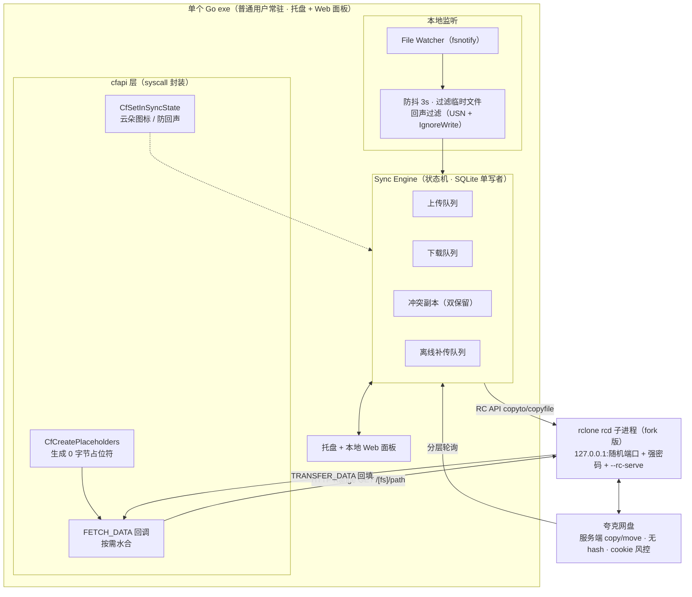

# Onerclone —— 需求与进度记录

> 更新时间：2026-09-28 · 状态：**Phase 1/2 完成**（成品 v0.2.0 已交付）；**Phase 4（v0.2.0 用户反馈三问题）代码已全部实施（2026-09-28，本机）**，待真机验收 + 出 v0.3.0 包；Phase 3 剩余：双机实测、10 万文件性能压测、Office 离线弹窗

---

## 0. 环境变更（2026-09-28，又换了一台机器）

- Go：`D:\0Project\Go\bin\go.exe`（v1.27.1，在 PATH 里）
- rclone：`D:\Tools\rclone\rclone.exe`（**v1.70.0-quark**，含 quark backend + rc ✓；不在 PATH）
- 仓库：`D:\0Project\0repos\Onerclone`
- Inno Setup：本机未装（出安装包前需 `winget install JRSoftware.InnoSetup --scope user`）
- 代码侧已适配：`resolveRclone` 兜底改为 `D:\Tools` → `D:\Software` 依次找；`build.ps1` 同款候选列表

---

## 1. 项目愿景

做一个类似 OneDrive 体验的夸克网盘 Windows 客户端（单个 Go exe）：

- 本地实体目录 + 0 字节占位符文件 + 资源管理器**云朵图标**
- 打开文件时**按需水合**（从云端拉数据）
- **断网可用**：目录树永远可见，已水合文件离线正常读写，未水合文件快速报错不卡死
- 本地改动**防抖后静默上传**，离线改动联网自动补传
- 双向同步 + 冲突副本，多台电脑共用同一账号最终一致

**核心验收故事**：第一天在同步目录修改 `1.doc`，第二天出差断网，`od/1.doc` 还在、且是修改后的版本，可正常打开。（反例基线：纯 `rclone mount` 断网整个目录消失。）

---

## 2. 需求清单（已与用户对齐）

### 功能需求（FR）

| # | 需求 | 精确表述 |
|---|---|---|
| FR1 | 虚拟占位符 | rclone 拉云端目录树 → `CfCreatePlaceholders`（**cfapi.h**，非 cldflt.h）生成 0 字节占位符；云朵图标 = 占位符 + **in-sync** + 未水合（漏设 in-sync 显示双向箭头） |
| FR2 | 按需水合 | `CF_CALLBACK_TYPE_FETCH_DATA` → 经 rclone 取流 → `CfExecute(CF_OPERATION_TYPE_TRANSFER_DATA)` 回填（4KB 对齐） |
| FR3 | 离线高可用 | 目录树离线可见；已水合文件离线读写；**未水合文件离线 = 回调立即返回 `STATUS_CLOUD_FILE_NETWORK_UNAVAILABLE`(0xC000CF11) → 用户 I/O 立即失败不卡死**（回调不响应 = 固定 60s 超时） |
| FR4 | 监听+防抖 | fsnotify 监听同步根；句柄释放 + 3s 无新事件才结算；过滤 `~$`/`.tmp`；稳定后入上传队列 → rclone `operations/copyfile`（经 RC API） |
| FR5 | 离线补传 | 离线修改持久化队列，联网自动重放 |

### 衍生需求（DR）

- **DR1 回声防护**：创建占位符产生 USN；`IgnoreWrite` 标记 + USN 比对 + `CfSetInSyncState(InSyncUsn)`。**实测补充：水合写入零 watcher 事件，比预期干净**
- **DR2 删除基线保护**：首次全量扫描建立基线前，禁止任何删除和覆盖上传
- **DR3 全回调实现**：注册了的回调必须响应（否则 60s 超时）
- **DR4 登录闭环**：扫码登录 → cookie 加密落盘 → 过期 UI 提示重新扫码
- **DR5 Sync Root 生命周期**：注册/注销/崩溃残留清理
- **DR6 磁盘缓冲**：夸克上传必须全量落盘临时文件，预留最大单文件空间
- **DR7 进程模型**：常驻 Daemon；cfapi 回调来自线程池、**并发重入**，必须加锁

### 非目标 / 约束（v1）

- 仅 **Windows 10 1709+**、仅 **NTFS**（ReFS/exFAT/FAT32 不支持）
- 单 Sync Root（如 `C:\Users\<你>\Onerclone`）
- 不做内核驱动、不做多云聚合

### 待真机验证的开放事实

1. ~~非管理员能否 CfRegisterSyncRoot~~ → **✅ 已回答：普通用户即可，无需 UAC**
2. 离线快速失败的实际弹窗表现 → **✅ 已验证：9~12ms 报“网络不可用”，不卡死**（记事本/PS 已测，Office/资源管理器待测）
3. Go 封装 cfapi 全链路 → **✅ 已打通**（见 §6）

---

## 3. 已锁定的 19 个决策

| # | 决策 | 结论 |
|---|---|---|
| Q1 | 需求基线 | FR1–FR5 + DR1–DR7 确认；未水合离线 = 快速报错（OneDrive 同款） |
| Q2 | 语言 | **Go** |
| Q3 | 数据规模 | 按 10 万文件 / 单文件 50GB 设计 |
| Q4 | 同步根与删除 | 单同步根（仅 NTFS）；本地删除 → 云端删除（回收站），受 DR2 保护 |
| Q5 | 缓存脱水 | 用户手动管理；**有未上传修改的文件禁止脱水** |
| Q6 | 云端变更落地 | 曾水合/PINNED 的联网自动重新下载；新文件只建占位符 |
| Q7 | 冲突 | **冲突副本双保留**（`1 (冲突 20260924).doc`），size+mtime 判定 |
| Q8/Q14 | UI | 托盘（systray）+ 本地 Web 面板（go:embed 单页，一次性 token）；承载队列/冲突/扫码/脱水管理 |
| Q9 | fork 姿态 | 钉死本 fork 版本；PR #9662 合并上游后切官方（rclone 版本可配置留后门） |
| Q10/Q17 | 多机 | 一账号多电脑，**对称双活**，冲突副本兜底 |
| Q11/Q19 | 提权打包 | **实测普通用户可注册（连 UAC 都不用）**；MVP 单文件绿色版，后续套 Inno |
| Q12 | rclone 集成 | **子进程 `rclone rcd`**（cookie/config 归属 + 崩溃隔离）；127.0.0.1 随机高位端口 + 随机强凭据 |
| Q13 | 状态库 | **SQLite**（modernc 纯 Go，WAL，单写者=Engine） |
| Q15 | 云端发现 | 自适应分层轮询（活跃 30–60s / 空闲 5min / 唤醒·联网·手动强制扫）+ 12h 全量对账兜底 |
| Q16 | 重试 | 分类退避：网络类指数退避无限重试（封顶 5min+抖动）；429/风控大幅降速；cookie 过期 → 停队列 + 扫码提醒 |
| Q18 | 删除 vs 冲突 | **冲突优先**：有分歧一律双保留，宁复活不删除 |

---

## 4. 架构定稿


```mermaid
flowchart TB
    subgraph EXE["单个 Go exe（普通用户常驻 · 托盘 + Web 面板）"]
        subgraph CFAPI["cfapi 层（syscall 封装）"]
            PH["CfCreatePlaceholders<br/>生成 0 字节占位符"]
            FD["FETCH_DATA 回调<br/>按需水合"]
            IS["CfSetInSyncState<br/>云朵图标 / 防回声"]
        end
        subgraph WATCH["本地监听"]
            FW["File Watcher（fsnotify）"]
            DB["防抖 3s · 过滤临时文件<br/>回声过滤（USN + IgnoreWrite）"]
        end
        subgraph CORE["Sync Engine（状态机 · SQLite 单写者）"]
            Q1Q["上传队列"]
            Q2Q["下载队列"]
            Q3Q["冲突副本（双保留）"]
            Q4Q["离线补传队列"]
        end
        UI["托盘 + 本地 Web 面板"]
    end
    RC["rclone rcd 子进程（fork 版）<br/>127.0.0.1:随机端口 + 强密码 + --rc-serve"]
    QD["夸克网盘<br/>服务端 copy/move · 无 hash · cookie 风控"]

    FW --> DB --> CORE
    PH --> FD
    FD -->|"HTTP Range GET /[fs]/path"| RC
    RC -->|"TRANSFER_DATA 回填"| FD
    IS -.-> CORE
    CORE -->|"RC API copyto/copyfile"| RC
    RC <--> QD
    QD -->|"分层轮询"| CORE
    CORE <--> UI
```

---

## 5. 关键事实（调研结论，别再踩）

### 5.1 fork 分支（zly2006/rclone @ agent/quark-backend）

- 基于 rclone v1.75，改动全在 `backend/quark/`，**core（fs/rc/cmd/vfs）零改动 → RC API 完整可用**；draft PR #9662，7 周无提交
- **对外无 Hash**（只能 size+mtime 比对）；**不能改已存在远端文件 mtime**
- 上传前必须**全量落盘临时文件**算 hash（秒传用）；登录 = 终端扫码 → cookie 滚动刷新（60s 节流写回配置）→ **会过期需重扫**
- 删除 = 进回收站；Copy/Move 服务端操作；文件名有 Unicode 规范化限制
- 用户本机实编译版：**`D:\Tools\rclone\rclone.exe`（v1.70.0-quark，含 quark backend + rc）**

### 5.2 Windows Cloud Files API（cfapi.h / CldApi.dll）

- 最低 Win10 **1709**、**仅 NTFS**；头文件是 **cfapi.h**（不是 cldflt.h）
- `CfCreatePlaceholders` / `CfExecute`(TRANSFER_DATA) / `CfSetInSyncState(handle, state, flags, *usn)` 全部确认存在
- **`FileIdentity` 对文件是必填字段**（漏了报 `0x8007017C` = STATUS_CLOUD_FILE_NOT_SUPPORTED）
- 回调固定 **60s 超时**；回调立即回失败 → 用户 I/O **立即失败**；错误码用 `STATUS_CLOUD_FILE_NETWORK_UNAVAILABLE`(0xC000CF11)（`CF_E_NETWORK_FAILURE` 不存在）
- `NormalizedPath` 是**卷内路径**（`\Users\...`），盘符要从 `VolumeDosName` 拼
- **Population 必须用 `ALWAYS_FULL`(3)**（微软 CloudMirror 示例同款）——PARTIAL 会让每次路径解析/枚举触发 `FETCH_PLACEHOLDERS`，应答不当 = 回调风暴（实测 3500 次/秒）+ 枚举 60s 超时 + 新建文件 `ERROR_INVALID_NAME`
- 云朵图标条件：placeholder + in-sync + 未水合；水合写入**不产生** watcher 事件（实测）
- 注册表 HKLM\...\SyncRootManager；**实测普通用户注册成功（elevated=false）**
- 参考实现：微软 CloudMirror（`Samples/CloudMirror/CloudMirror/`，回调表只注册 FETCH_DATA + CANCEL）

### 5.3 rclone RC

- **没有 `operations/cat`/`operations/open` 等直读内容的 RC 方法**（官方方法全表核实）
- **水合数据通道 = `--rc-serve` + HTTP GET `/[<fs>]/<remote>` + Range 头**（fs 放**方括号**里，源码 `fsMatch` 正则 `^\[(.*?)\](.*)$`；206 精确区间已实测 ✅）
- RC 请求体必须是 JSON（无参数也要发 `{}`）
- 上传 = `operations/copyfile`；列举 = `operations/list`（`Path` 字段 = 相对远程根路径）

### 5.4 aliyunpan（tickstep）调研结论

- **没有虚拟盘/挂载**，纯 CLI 轮询同步器（全量扫描 → diff → 传），与我们方案不同路
- **值得借鉴（Phase 1 抄）**：三库状态模型（本地快照/云端快照/动作队列 bolt）、入队幂等与频控（成功 1 分钟冷却、失败分层冷却、进行中去重）、上传前复查 mtime、**拔盘误删保护（本地根消失宁可停机也不执行删除）**、列表接口 1.5s 风控节流、size+mtime 未变复用哈希捷径
- 它的双向同步是 TODO 半成品；冲突无真解（单向覆盖）

---

## 6. 当前进度（Phase 0 Spike）

### 代码结构

```
Onerclone/
├── go.mod                    module onerclone（Go 1.27.1）
├── reference/cfapi.h         Windows SDK 10.0.16299 头文件（移植蓝本）
├── internal/
│   ├── cfapi/                Cloud Files API 的 Go syscall 绑定
│   │   ├── types.go          结构体/枚举（x64 布局逐字段对照头文件核验）
│   │   └── cfapi.go          注册/连接/回调桩/TRANSFER_DATA/占位符创建/in-sync
│   └── rclone/
│       ├── rc.go             RC 客户端（List/RangeGet/CopyFile/Version）
│       └── daemon.go         rclone rcd 子进程管理（启动/就绪探测/Exited 监控）
└── cmd/spike/                Spike 验证程序（register / run / unregister 子命令）
    ├── main.go               占位符初始化 + FETCH_DATA 水合 + watcher 防抖上传
    └── shellreg.go           Shell 集成（SyncRootManager 注册表项，图标依赖，见坑6）
```

### 环境（本机 · 2026-09-25 更新）

- Go：`D:\Software\go\bin\go.exe`（v1.27.1，已入用户 PATH）
- rclone：`D:\Software\rclone\rclone.exe`（v1.70.0-quark）
- 同步根：`C:\Users\Jw\OnercloneSpike`（已注册）
- 云端替身（spike 测试用 local 后端）：仓库内 `spike-remote`
- 日志：`spike.log`（控制台 + 文件双写）

### 运行手册

```powershell
cd D:\0Code\Onerclone

.\spike.exe register            # 注册同步根（普通用户即可）
.\spike.exe run                 # 启动（在线模式）
.\spike.exe run -offline        # 离线模式（水合立即快速失败）
.\spike.exe unregister          # 注销同步根
```

### ✅ 已验证通过（Phase 0 成果）

| # | 验证项 | 结果 |
|---|---|---|
| 1 | 普通用户注册同步根 | ✅ elevated=false 注册成功，**无需 UAC** |
| 2 | 占位符批量创建 | ✅ 3 文件 7ms（FileIdentity 必填坑已过） |
| 3 | **水合全链路** | ✅ FETCH_DATA → rc-serve Range(206) → TRANSFER_DATA 回填；hello 2ms / 8MB 21ms / 嵌套 1ms，字节级正确 |
| 4 | 离线快速失败 | ✅ 9~12ms 报“网络不可用”，不卡死（开放事实②） |
| 5 | Population=ALWAYS_FULL | ✅ 枚举 60s 超时 → **0ms**；新建文件/目录 INVALID_NAME → **OK**；回调风暴消失 |
| 6 | 水合零回声 | ✅ 水合写入不产生 watcher 事件（DR1 事实）；**但据此在 FETCH_DATA 里 markSelfWrite 是错的（见坑3）** |
| 7 | 事件监听 + 防抖 | ✅ raw 事件 → 入队（脏计数）→ 3s 后 AfterFunc 结算 → 触发上传 |
| 8 | 心跳/日志探针 | ✅ 30s 心跳正常，watcher 存活可证 |
| 9 | **上传链路（占位符修改）** | ✅ 2026-09-25：hello.txt WRITE → 3s 结算 → copyfile → 云端替身含 ROUND4–7 → SetInSync 成功（8ms） |
| 10 | **本地新建文件上传** | ✅ brand-new/fresh-upload：普通文件 → copyfile → **CfConvertToPlaceholder(MARK_IN_SYNC)** 一步转换+标记 |
| 11 | **rcd 保活** | ✅ 多轮长跑（>10min）rclone rcd 未再死掉；“20 秒死”是语法错误期的误判 |
| 12 | **⭐ 云朵/绿勾图标（FR1 肉眼验收）** | ✅ 2026-09-25 截屏验证：hello/brand-new/fresh → **绿勾**（已水合+in-sync）、big.bin → **云朵**（未水合）、sub → 同步箭头（普通目录，未转占位符）。根因见坑6 |

### 🕳 已踩过的坑（2026-09-25 修复，写 Phase 1 代码前必读）

1. **orphan 语句语法错误**：上次编辑把 `log.Printf` 插到了 `onSettled` 函数外 → 已修。
2. **`CfSetInSyncState` 报 `0x80070178`（Win32 376 = “此文件不是云文件”）**：用户**新建的普通文件**上传后直接 SetInSync 必失败。正确姿势：`CfConvertToPlaceholder(handle, nil, 0, CF_CONVERT_FLAG_MARK_IN_SYNC, NULL, NULL)` 一步转换+in-sync。已封装 `cfapi.ConvertToPlaceholder`（句柄需 GENERIC_READ|GENERIC_WRITE，属性级访问不够）。
3. **回声抑制误杀真实写入**：`handleFetchData` 里 `markSelfWrite`（15s 窗口）会吞掉**水合之后的真实用户写入**（Add-Content 先触发水合再落盘 → WRITE 被当回声）。既然实测水合零事件，该标记已删除。
4. **⭐ Go 1.23+ `os.FileMode` 坑（最重要的坑）**：CFAPI 占位符的 reparse tag 是 `IO_REPARSE_TAG_CLOUD_*`（未知 tag）→ Go 判为 **`ModeIrregular` → `IsRegular()==false`**！任何 `st.Mode().IsRegular()` 过滤都会**静默跳过所有占位符**。正确判法：irregular 时再查 `syscall.GetFileAttributes`，带 `FILE_ATTRIBUTE_REPARSE_POINT` 且非目录 = 云占位符，**照常参与同步**（同机 `go run` 的临时进程可能取不到 ReparseTag 显示 regular，别被误导，见 os/types_windows.go:227）。
5. PowerShell `Get-Content spike.log` 默认按 ANSI(GBK) 解码 UTF-8 会满屏乱码；用编辑器/grep 工具看原文。
6. **⭐⭐ 图标不显示的根因（2026-09-25 破案，FR1 验收关键）**：`CfRegisterSyncRoot` 只做内核级注册（`CfGetSyncRootInfoByPath` 可查到），**不写 `HKLM\...\Explorer\SyncRootManager` 注册表项**；而 Explorer 的状态图标（绿勾/云朵/同步箭头）**完全依赖这层 Shell 注册**（官方文档 "Integrate a Cloud Storage Provider"：该键由 provider 自己创建，键名 `[ProviderName]![SID]![AccountID]`，需写 `DisplayNameResource`/`IconResource`/`Flags=0x162`/`UserSyncRoots\[SID]=路径`）。文件占位符状态全对（PLACEHOLDER+IN_SYNC 探测为绿）也绝不显示图标。已封装进 `cmd/spike/shellreg.go`（`register` 自动写、`unregister` 自动删，普通用户可写该键）。**写完/改完需重启 Explorer 才生效**。证据：`final_zoom.png`、`verify_final.png`。
7. **无签名进程读不到占位符属性位**：Go/无签名 C# 进程 `GetFileAttributesW` 对占位符返回 `0x20`（丢 REPARSE/SPARSE/OFFLINE 位），微软签名宿主（PowerShell）读到 `0x420`——诊断占位符状态**必须用签名宿主**（如 PS + P/Invoke），否则探针全是假阴性（`NO_STATES`）。（spike 进程因已 Connect sync root 可见真实属性。）

### ⚠️ 待肉眼验收（Phase 0 收尾）

- [x] 资源管理器确认云朵图标（FR1）→ **✅ 2026-09-25 通过**，见坑6 + `final_zoom.png`/`verify_final.png`；`sub` 目录是普通目录未转占位符（显示同步箭头），Phase 1 需把目录也转占位符
- [ ] 离线模式（`run -offline`）下用记事本/资源管理器实测弹窗表现（开放事实②收尾，Office 待测）
- [ ] （可选顺带）目录列举按 mtime 增量的可行性（Q15c）

---

## 8. 后续 Phase 划分

- **Phase 0（Spike）**：✅ 完成（全链路 + 开放事实 + 图标验收，见 §6）
- **Phase 1（MVP）**：**完成（2026-09-25）**，详见 §9；DR4 扫码/下载/上传/删除回路、rcd 断线自动重启、Q6 主动重拉、0x80070057 修复均已真机验证；仅剩**离线弹窗肉眼验收**（程序侧 5ms 快速失败已验证）
- **Phase 2**：托盘 + Web 面板（队列/冲突/扫码/脱水管理）、冲突副本可视化 —— ✅ **全部完成（2026-09-27）**
- **Phase 3**：打包（Inno）、开机自启、双机实测、10 万文件性能压测 —— 打包 ✅（zip + Inno 安装包）、开机自启 ✅（`onerclone autostart`，HKCU 无 UAC）；**剩余：双机实测、10 万文件性能压测、Office 离线弹窗肉眼验收**

## 9. Phase 1 进度（2026-09-25）

### ✅ 已完成并测试

| 模块 | 内容 | 验证 |
|---|---|---|
| `internal/state` | SQLite 三库（local_snap/cloud_snap/queue + meta），modernc 纯 Go（Q13）、WAL、单写者；队列幂等入队（path+kind 唯一、inflight 保护）、崩溃回收 ReapInflight、四类分类重试（Q16：network 指数退避封顶 300s+抖动无限重试 / rate_limit 60s×n / auth→failed 停队列 / permanent） | 单测 5/5 ✓ |
| `internal/engine` | 双向 diff（Scan/Poll 三方对账）；**动作互斥升级**（upload∩pending download → conflict，Q18 冲突优先）+ CancelOthers 抢占 + 前复查兜底（upload 查云端 mtime、download 查本地、删除查双侧复活）；DR2 基线门；快照即回声防护（结构性消除 P0 selfWrite 坑） | 单测 7/7 ✓ |
| `cmd/spike` 接线 | state.db 初始化、首轮基线（Scan+Poll）、RunWorker、Q15 分层轮询（活跃 60s/空闲 5min/12h 对账 + 本地事件 kick 立即对账）、watcher 防抖→engine.Scan、adapters.go（cloudRC/localFS 注入 cfapi+rclone） | 集成 A–E ✓ |
| rclone RC 扩展 | Stat/DeleteFile/Mkdir/Purge/ListRecursive | ✓ |

### ✅ 生产集成测试（local 后端全链路，2026-09-25）

- **A 本地改→上传**：hello.txt → copyfile → 云端一致 ✓
- **B 云端改→下载**：spike-remote 直改 → Poll → 本地占位符重建 → 内容一致 ✓（修了**下载回环 bug**：local_snap 必须写本地实际 stat 而非云端 mtime，否则下轮误判回环上传）
- **C 本地删→云端删**：0.8s 传播 ✓；批量删 5 文件全传播 ✓
- **D 云端删→本地删**：✓（删除回声被快照吸收，无误入队）
- **E 双改→冲突双保留（Q7/Q18）**：本地版留原名上传 + 云端版存 `nested (冲突 时间).txt` + 副本自动回传云端 → **本地/云端各两份** ✓
- 状态库跨重启持久化（重启入队 0）✓；目录走 Mkdir 非 copyfile ✓

### 🕳 P1 踩坑（写后续代码前必读）

8. **快照语义=三方对账的唯一真相**：`local_snap/cloud_snap` 记录"上次观测"，conflict 不能在 Scan/Poll 单侧判定（信息不足）——主裁决=**动作互斥升级**（两侧 pending 相遇），兜底=exec 前复查。曾因 Scan 把"云端快照存在"误判为"云端变过"→ 每次本地修改都错误走 conflict。
9. **execDownload 快照对齐 bug**：local_snap 写云端 mtime → 占位符实际 mtime 不同 → 下轮 Scan 误判"本地改"→ 回环上传+多余水合。**local_snap=本地实际 stat，cloud_snap=云端观测**，各归各。
10. **交错 replace_string_in_file 会产出残缺结构**（两次局部替换撞车 → 混入残缺注释 + 花括号错位，编译错误行号还滞后于根因）。诊断：gofmt 首错在 func 行 = 前文函数体未闭合；用 `go/parser` + 深度状态机（跳过字符串/注释）定位。修复后必须跑全量测试。
11. **单侧动作与删除互斥的边缘**：pending upload 会挡住 delete_local（localChanged=true 走复活分支）——语义=Q18 宁复活，可接受；测试需先 drain 首轮动作再断言删除。
12. **旧 spike 进程占连接**：CF 同步根同时只能一个 provider 连接（0x8007017A "already connected"）；重启测试前必须 `Stop-Process -Name spike`（+ 杀残留 rclone rcd）。
13. **切 remote 必须换 state.db**：`cloud_snap` 是“上次在哪个后端看到什么”的真相，换 `-fs`（本地替身）→ `-remote quark:` 后旧快照里的条目在新后端不存在 → 被判“云端已删”→ **误删本地文件**。真实 remote 验证要用隔离同步根（`-root ...dr4\sync`，state 路径 = `filepath.Dir(root)\OnercloneSpike.state`）。
14. **quark 二维码在 TTY 下不打印**：`v1.70.0-quark` 的 `config create` 交互路径实测零输出（重定向 0 字节、屏幕缓冲区也无写入）；二维码只存在于 `--non-interactive` 输出 JSON 的 `Option.Help`（提示语 + ANSI 二维码 + 备用链接）。修复见 `cmd/spike/quark.go` + `cmd/spike/console_windows.go`（开 VT100）。
15. **FILETIME 偏移少一个 0（0x80070057 真因）**：`cfapi.toFiletime` 写成 `11644473600000000`（应为 `116444736000000000` = 11644473600s × 1e7）→ 时间整体偏 116 年，且 **1960 年以前的 mtime 算出负 FILETIME** → `CfCreatePlaceholders` 判 ERROR_INVALID_PARAMETER → 该文件永远建不出占位符、被归 network 类无限退避重试（实测样本 `spike-remote\big.bin`，磁盘 mtime 真是 1694-08-19）。修：秒级换算 + 两端饱和 + 不能用 `UnixNano()`（仅 1678~2262 有定义）。取证手法：隔离参数的 `CfCreatePlaceholders` 探针（`size=-1`、`mtime=1694` 必现；零值/epoch/1602 正常）+ 单测 `internal/cfapi/filetime_test.go`。
16. **rclone 在 Windows 对文件名做 Unicode 归一化 → “全角替换”方案不可用**：磁盘目录 `来自：分享`（U+FF1A），Go `os.ReadDir` 看到全宽，但 rclone `lsf`/`stat` 只报、只认 ASCII `来自:分享`（U+003A），且 `--no-unicode-normalization` **无效**（实测开/关结果相同）→ `operations/copyfile` 报 `object not found`（**Go 与 rclone 互认不了对方的路径写法**）。修：namemap 改为**纯 ASCII `%XX` 转义**（meta key 升到 `local_name_map_v2`，旧全宽映射表自动作废），并对任何 NFKC 会改动的字符（全角字母数字/标点、表意空格…）一并转义，保证两边字面一致。
17. **实例运行时删同步根 = 把删除传播到云端**：为重置测试根，在 `spike run` 进程还活着时 `Remove-Item` 了 dr4 同步根 → watcher 把整根删除转成 delete_cloud → **用户夸克网盘里的 `心流_...Notebook.html`（32991B）被同步删除**（`来自:分享/` 目录因 `is a directory not a file` 幸免）。规矩：**先停实例（Enter 或杀进程）→ 再动同步根**；恢复依赖夸克回收站（已确认不用恢复）。
18. **面板扫码会反过来吃掉你的 cookie（已修）**：`rclone config create` 会**重建整个 remote 段** → 已有 cookie 被清；而 `rclone config show` 又把 cookie 掩码成 `*** ENCRYPTED ***` → 用它取值再 update 等于写入垃圾。修法：**直接读写原始 `rclone.conf`**（`rclone config file` 拿路径，自解析 INI，创建前快照 [quark] 段、创建后/失败时把丢失的键原样写回）。验收：扫码会话前后 cookie **2162 字节完全一致**；失败路径由 `restore()` 再补一次。

### ⬜ Phase 1 剩余

- [x] ~~**夸克真实 remote（DR4）**~~ → **✅ 2026-09-25 真机验证通过**
  - 扫码：`spike quark-login` 重写为 `--non-interactive` 协议（解析 JSON 拿 `Option.Help` → spike 自己打印二维码 + 备用链接 → `--continue --state qr_poll --result true` 让 rclone 轮询到扫码完成），新增 `console_windows.go` 开 VT100（否则 ANSI 二维码退化成空白）、`-tries` 超时自动重出二维码。实测：扫码成功 → cookie（2171B）写入 rclone.conf → `lsd quark:` ✓
  - 同步：`run -root C:\Users\Jw\OnercloneSpike.dr4\sync -remote quark:` 基线入队，真实网盘文件下载落地 ✓、占位符/水合链路在真实 remote 上工作 ✓；**上传/删除回路亦已真机验证**（本地 `来自%3A分享/dr4-uplink-verify.txt` → `📁 云端建目录 来自:分享` → `⬆ 上传完成` → 本地删 → `🗑 云端已删`，云端目录名与云端原名逐字一致）
  - ⚠️ 事故记录：重置测试根时误删了云端 `心流_...Notebook.html`（见踩坑 #17），待从夸克回收站恢复
  - cookie 过期 → 引擎 auth 分类停队列 + 日志提醒重扫码 ✓（引擎侧完成）
- [x] ~~**云端非法字符命名策略（DR4 新发现）**~~ → **✅ 2026-09-25 方案 A 已实现并真机验证**
  - 问题：quark 目录名可以含 `:`（如 `来自:分享`），Windows 建不出来 → `localFS.ApplyDownload` 的 `MkdirAll` 报 "The directory name is invalid"，引擎按 network 类无限退避重试
  - 实现（`cmd/spike/namemap.go`）：段级**纯 ASCII `%XX` 转义**（`<>:"|?*`、控制字符、尾部空格点→`%20/%2E`、保留设备名→`%5F`前缀、**以及任何 NFKC 会改动的字符**如全角标点字母）；映射表持久化在 state.db meta `local_name_map_v2`（v1=全宽方案已作废，见踩坑 #16）；转义是单射（含 `%` 的段必被转义），另保留 `~<hash6>` 兜底；表只存改名项，十万文件不膨胀
  - 接线：`localFS.path()`（Stat/ApplyDownload/Remove/FinalizeUpload/WasHydrated）、`localFS.Scan` 反向还原、`cloudRC.Upload/Download/DownloadTo` 本地侧、`populate` 占位符名、`app.rel`（水合取数按云端名）—— **engine 的 path 键永远是云端原名**，快照/队列/冲突逻辑零改动
  - 验证：单测（净化规则/单射性、双向映射、重启持久化、损坏恢复、nil 直通、localFS.Scan 反向、ApplyDownload 落地）全绿 + 真机：`来自:分享` 落地为本地 `来自%3A分享` ✓、Scan 反向还原无伪回传 ✓、**上传/删除回路通过** ✓
- [x] ~~rcd 断线自动重启（FR5 完整闭环）~~ → **✅ 2026-09-25 实测**：杀 rclone → 5s 首档退避自动重启（5→10→20→30s 封顶无限重试）→ `atomic.Pointer` client 热替换（引擎/水合无感知）→ 杀后入队的上传在恢复后成功落到云端。证据见 `cloudRC.SetClient` + run 内监控循环
- [x] ~~离线模式（`-offline`）肉眼验收（P0 遗留）~~ → **程序侧已验证（2026-09-25）**：`READY [离线（-offline：水合立即失败）]`；未水合占位符 `big.bin` 读取 **5ms** 内失败并日志 `⊘ [offline] 读取 big.bin [0,+8388608) → 立即返回 NETWORK_UNAVAILABLE`；已水合文件（hello.txt）离线直接可读 ✓。**肉眼验收已做（2026-09-27，用户实测）**：VS Code 打开占位符报 `Unable to read file '...big.bin' (Unknown (FileSystemError): An unknown error occurred. Please consult the log for more details.)` —— 应用层拿到明确错误、5ms 快失败、不卡死不崩，同时日志出现 `⊘ [offline] 读取 ...`。（注意：必须开**正在运行的那个根**，跨根打开不会触发弹窗；记事本/Office 未测，留 Phase 3 收尾）
- [x] ~~Q6 完整语义：曾水合文件云端变更后**主动**重拉数据~~ → **✅ 2026-09-25 实现 + 真机验证**：`engine.Local` 新增 `Hydrate(rel)`（`localFS` 实现：读一遍占位符触发 FETCH_DATA → rclone RangeGet → 回填 → `SetInSync`），`execDownload` 对"曾水合"文件在建完占位符后立即重拉（日志 `🔄 Q6 主动重拉完成 xxx（已就地可读）`），失败只降级为读时懒水合、不判动作失败；新文件仍只建占位符（不白拉流量）。单测 `TestQ6RereadsPreviouslyHydratedFile`（首轮不重拉 / 云端变更后恰重拉 1 次）；真机：改云端 `hello.txt` → `💧 水合` + `🔄 Q6 主动重拉完成`，下载窗口结束即可离线读
- [x] ~~`sub` 目录占位符预热 0x80070057（INVALID_PARAMETER）待查~~ → **✅ 已修（根因不是 sub，是 FILETIME）**：见踩坑 #15。复验：`✅ 占位符就绪: 5 个文件`（含 8MB `big.bin`）无任何报错，引擎重试也消失

---

## 10. Phase 2 进度（2026-09-27）

### ✅ 第 1 片：本地 Web 面板（只读）—— Q8/Q14

| 部件 | 内容 |
|---|---|
| `internal/state` | 新增 `ListActions(states, limit)`：只读列举队列（默认除 done 外、按 updated 倒序、上限 200），不动状态 |
| `cmd/spike/panel.go` | 127.0.0.1 随机端口；**一次性 token**（`?t=` 换会话 Cookie 后立即作废，日志里那行链接只能点一次）；Cookie `HttpOnly + SameSite=Strict`；`GET /` 出单页、`GET /api/state` 出 JSON（status + actions）；**只读**，无任何改状态的接口 |
| `cmd/spike/ui/index.html` | `go:embed` 单页：暗色卡片（基线/待执行/永久失败/认证失败/已完成/时长）+ 队列表格（类型/状态/重试/下次/错误），2s 轮询，403 自提示 |
| 接线 | `cmdRun` 在打开状态库后启动面板并打印一次性链接，`defer` 关闭；面板失败不影响同步 |
| 验证 | 单测 `panel_test.go`（token 一次性、Cookie 会话、伪造 Cookie 403、API JSON 形状与队列内容）✓；真机：浏览器打开一次性链接 → 302 发 Cookie → 页面正常渲染 + `/api/state` 轮询 ✓ |

### ✅ 第 1.5 片：成品化与打包（2026-09-27）—— 要的「exe 成品」**

| 部件 | 内容 |
|---|---|
| 配置 | 新增 `cmd/spike/config.go`：exe 同目录 `onerclone.json`（首次运行自动生成模板；不可写则退回用户配置目录）；**三级优先级 flag > 配置 > 内置默认**；**容忍 UTF-8 BOM**（Notepad/PS5.1 保存常见，Go 的 json 不认）；默认 `remote: "quark:"` |
| rclone 自动发现 | `resolveRclone`：flag → 配置 → **exe 同目录 `rclone.exe`** → PATH → 兜底路径（发布包把 rclone 放 exe 旁即可开箱） |
| 启动行为 | **无参数即开始同步**（`onerclone.exe` 双击可用）；`version`/`help` 为信息命令（不落日志、不读配置，避免污染发布目录） |
| 首启健壮性 | 首轮 Poll 失败（多为未扫码/cookie 过期）**不再 Fatal**：DR2 保护仍生效 + 日志提示先跑 `onerclone quark-login`，后续轮询自动补基线 |
| 控制台 | 启动即 `SetConsoleOutputCP/SetConsoleCP(65001)`：Go 输出 UTF-8，传统 conhost（936）会把中文日志渲染成乱码（实测 help 输出字节本身合法，纯显示问题） |
| 日志 | 固定写 **exe 同目录 `onerclone.log`**（原 `spike.log` 相对路径会跟着 CWD 跑偏） |
| 版本 | `main.version/main.buildDate` 由 ldflags 注入；`onerclone version` → `onerclone v0.2.0 (build 2026-09-27)` |
| 打包 | `build.ps1`（测试 → 构建 → 组装 → 自检 → zip，**需 UTF-8 BOM**，否则 PS5.1 按 GBK 解析脚本会报语法错）→ `dist\onerclone-v0.2.0-win64\`（onerclone.exe 11.5MB + rclone.exe 77.6MB + README + VERSION）与 **`dist\onerclone-v0.2.0-win64.zip`（31.5MB）**；`dist/`、`onerclone.log`、`onerclone.json` 已入 `.gitignore` |
| 文档 | 新增根 `README.md`（环境要求/快速开始/配置表/命令/行为说明/构建/已知边界），打包时复制进发布目录 |
| 冒烟测试 | ① **本地模式**（BOM 配置、零云端）：版本/配置读取/rclone 自动发现/示例数据/基线 4 项/占位符/面板 token 一次性(403)+Cookie+API JSON/云端改动 kick → `⬇ 下载完成` 全通；② **真实 quark 只读**：`来自:分享` 落地为本地 `来自%3A分享`（%3A 转义 ✓）、网盘零写入；③ 冒烟同步根已 unregister + 临时目录已删 |

### ✅ 第 2 片：面板管理动作 + 冲突可视化（2026-09-27）

| 部件 | 内容 |
|---|---|
| `state` | 新增 `Retry(id)`（回 pending、清尝试/错误）、`Drop(id)`（删行） |
| `engine` | 新增 `KindDehydrate` 动作 + `execDehydrate`（复用 download 落地路径但**禁用 Q6 重拉**，否则刚释放的空间又被拉回）+ 面板 API：`RequestDehydrate`（未水合返回 false→面板 409）、`IsHydrated`、`RetryAction`、`DropAction` |
| 面板端点 | `POST /api/action/retry` `POST /api/action/drop` `POST /api/dehydrate` `GET /api/conflicts` `POST /api/quark/start` `GET /api/quark/status` `GET /api/quark/qr.png`（全部走同一 Cookie 鉴权） |
| 扫码登录 | 复用 CLI 的 `--non-interactive` 协议，后台跑 `--continue` 轮询；`go-qrcode` 服务端出 PNG（320px）；页面轮询 status 直到 done/failed |
| 冲突可视化 | 读 `local_snap/cloud_snap` + `conflict` 动作，展示两端大小/时间与 `xxx (冲突 时间).ext` 副本（双侧） |
| UI | 队列表格行内**重试/放弃/脱水**按钮、冲突区、扫码卡片（刷新时自动恢复进行中的会话） |
| 验证 | 单测：`TestPanelActionEndpoints`（重试回 pending、放弃消失、未水合 409、水合后入队 dehydrate）+ `TestPanelConflicts`（两端快照与副本识别）✓；真机：QR PNG 1156B 魔数 `89-50-4E-47`、`🫙 已脱水 hello.txt` 日志 ✓ |

### ✅ 第 3 片：托盘 + 开机自启 + 安装包（2026-09-27）

| 部件 | 内容 |
|---|---|
| 托盘 | `cmd/spike/tray.go`（`getlantern/systray`）：菜单 = 打开面板（读全局一次性链接）/ 打开同步根 / 打开日志 / 退出（走 `trayQuit`，与 Ctrl+C 同一条退出路径）；图标 `cmd/spike/ui/tray.ico` 由一次性生成器产出（32×32 32bit 云朵，BGRA+AND 手写 ICO 容器）；启动 panic 只记日志不影响同步 |
| 开机自启 | `onerclone autostart`（`-enable/-disable`/查询）→ HKCU `…\CurrentVersion\Run`，**普通用户无 UAC**；安装包按任务自动调用，卸载时自动关闭 |
| 安装包 | `installer.iss`（Inno 6：`PrivilegesRequired=lowest` 装到 `{localappdata}\Onerclone`、任务=桌面图标/开机自启/装完启动、卸载时关自启+注销同步根+清日志/状态）；`build.ps1 -Installer` 自动找 ISCC；本机用 `winget install JRSoftware.InnoSetup --scope user` 装了 6.7.3 |
| 验证 | 静默安装（`/VERYSILENT`）→ 文件齐全 → `onerclone version` ✓ → 安装任务写入的自启注册表值正确 ✓ → `autostart -disable` 关闭 ✓；真机联调：托盘启动日志 `📌 托盘已启动`、面板全端点 200、**cookie 前后 2162 字节完全一致**（见踩坑 #18）✓ |

---

## 11. 用户实测反馈（v0.2.0 成品，2026-09-28）→ Phase 4 待办

> 背景：用户在新设备跑了 `dist\onerclone-setup-0.2.0.exe` 安装的成品，提出 3 个问题。
> 本轮已完成**代码调研 + rclone 协议实测**，方案已定但**代码尚未实施**——换设备续作时从这里接。

### 问题 ① Explorer 状态图标（云朵/对勾）不显示

**现象**：文件系统层占位符正常（水合/同步功能完好），但资源管理器里没有同步状态图标。

**本机取证结果（2026-09-28）**：
- `HKLM\...\Explorer\SyncRootManager` 下**只有 OneDrive 的键，没有任何 Onerclone 键** → 说明用户跑 dist 成品时 Shell 注册层从未成功写入（或被清掉）
- `shellreg.go` 的注册逻辑只在 `onerclone register` 命令里调用；`cmdRun`（双击 exe 直接跑）只调 `CfRegisterSyncRoot`（内核层）+ `RegisterFlagUpdate`，**从不写 SyncRootManager 注册表** → 这就是图标消失的直接原因
- dist 发布目录里也没有 `onerclone.log`（用户机器上跑的），无法确认当时是否报过 `⚠ Shell 注册失败`

**修复方案（已定，未写码）**：
1. `cmdRun` 启动时**自动补 Shell 注册**：调 `shellRegister(root)`，失败只记日志不 Fatal（与 register 命令同款容错）
2. 顺带排查 `shellRegister` 的两个潜在坑：
   - `registry.CreateKey(LOCAL_MACHINE, …)` 在某些机器上普通用户可能无权限写 HKLM（本机实测可写，但用户机器未知）→ 失败时降级写 `HKCU\...\SyncRootManager`（OneDrive 也用 HKCU 层，Explorer 两层都认）
   - `Flags=0x162` 与 `IconResource=imageres.dll,-1043` 照抄 OneDrive，若仍不显示再试 `Flags` 加 `PreventPinnedToDesktop` 等位
3. 验收：注册表键出现 + 重启 Explorer（或注销重登）后云朵/对勾显示

### 问题 ② 同步根可自定义（不想放 C 盘用户目录）

**现状**：`sync_root` 已支持 `onerclone.json` 配置 + `-root` flag，但改路径有两个坑：
- **state.db 路径跟着同步根走**（`main.go` 里写死 `filepath.Dir(syncRoot)\OnercloneSpike.state`）→ 换根后旧队列/基线全部丢失，且旧根目录残留状态库
- 换根后旧同步根的 cfapi 注册还在（内核层 + Shell 层都残留）→ Explorer 里旧目录仍显示云图标

**修复方案（已定，未写码）**：
1. **state.db 固定放 exe 同目录**（或 `%LocalAppData%\Onerclone`），与同步根解耦——换根不丢队列/基线/namemap
2. 面板加「设置」区：改 `sync_root`（选目录）+ 改 `remote`（下拉已有 remote）→ 写回 `onerclone.json` → 提示"重启生效"；顺带显示当前配置
3. `cmdRun` 启动时检测：配置的根 ≠ 当前注册的根 → 自动 unregister 旧根 + register 新根（或提示用户跑 `onerclone register -root 新根`）
4. 注意踩坑 #13：**换根不等于换 remote**，但如果同时换了 remote，state.db 里的 cloud_snap 必须作废（加 `remote` 指纹到 meta，变更即清空 cloud_snap + 重建基线）

### 问题 ③ 开放任意 rclone 后端（不只夸克）

**用户原话**：需要开放别人夸克扫码**或者别的 rclone 登录方式**，相当于做了一个 Windows 资源管理器同步显示（cfapi）+ 增删查改的工具，上传下载存储还是依赖 rclone，**适配所有 rclone 的存储 config**。

**rclone 非交互协议实测（2026-09-28，本机 v1.70.0-quark）**——这是本问题最重要的调研成果：
- `rclone config providers` 返回全部后端 JSON（本机 80+ 个：dropbox/onedrive/drive/s3/webdav/ftp/sftp/mega/quark/…）
- `rclone config create <name> <type> --non-interactive` 是**通用状态机**，逐题吐 JSON（State/Option.Name/Option.Help/Required/Examples），答 `--continue --state <State> --result <值>` 推进：
  - **OAuth 后端（dropbox 实测）**：首问 `*oauth-islocal`（本机有无浏览器）→ 答 `true` 后 rclone **自己开浏览器等本地回调**（面板场景完美）；答 `false` 则进 `*oauth-authorize` 状态，Help 里给出指引（`rclone authorize "dropbox"` + 粘贴结果），面板可渲染成输入框
  - **扫码后端（quark）**：qr_start/qr_poll（已实现，见 quark.go）
  - **无必填项后端（local/ftp 实测）**：直接落盘，返回 `State:""`（完成态判定 = State 为空）
- ⚠️ `config create` 会重建整个 remote 段（踩坑 #18 的 cookie 丢失问题对 OAuth token 同样适用）→ 通用登录必须沿用 quark.go 的「原始 rclone.conf 快照 + 恢复」套路

**修复方案（已定，未写码）**：
1. 新增 `onerclone login`（CLI）+ 面板「添加远程存储」卡片：
   - `GET /api/remotes`（列 `rclone listremotes` + 各自 type）+ `GET /api/providers`（列后端类型）
   - `POST /api/login/start` `{name, type}` → 驱动非交互状态机：普通必填题渲染成表单、OAuth islocal=true 直接让 rclone 开浏览器、扫码题渲染二维码（复用现有 quark 渲染）、`*oauth-authorize` 渲染"粘贴 token"输入框
   - `POST /api/login/answer` `{state, result}` 推进状态机直到 `State:""`
   - 全程套用 conf 快照/恢复保护旧凭据
2. `onerclone.json` 的 `remote` 字段本就是任意 rclone remote 语法（`dropbox:`、`onedrive:path/sub` 都合法）→ 引擎侧零改动；`classify` 的 auth 关键字已覆盖 OAuth 过期（401/403/token expired）
3. 面板「设置」区加 remote 下拉（问题 ② 的设置区顺带做）
4. 文档：README 补「支持任意 rclone 后端」说明 + 各后端登录方式差异表

### Phase 4 实施顺序建议

1. 问题 ①（最小：`cmdRun` 补 `shellRegister`，几行代码，先让图标回来）
2. 问题 ②（state.db 解耦 + 面板设置区）
3. 问题 ③（通用登录状态机，工作量最大；② 的设置区先落地，③ 复用其 remote 下拉）
4. 全部完成后 `build.ps1 -Version 0.3.0 -Installer` 出新包，真机验收三项

---

## 12. Phase 4 实施记录（2026-09-28，本机完成代码，待真机验收）

> 上轮（§11）定的三个修复方案本轮**全部落码**。全量测试 + vet 绿；rclone 协议侧
> 用本机 v1.70.0-quark 实测过 `config providers`（顶层数组）与 ftp 完成态。

### ✅ 问题 ① Explorer 状态图标 —— `cmdRun` 自动补 Shell 注册

- `cmdRun` 在 `CfConnectSyncRoot` 成功后自动调 `shellRegister(root)`（幂等，失败只记日志）
- `shellreg.go`：HKLM 写被拒时**降级写 HKCU**（OneDrive 同款层级，Explorer 两层都认）；`shellUnregister` 同时清理两层
- 验收待做：用户机器装 v0.3.0 → 注册表键出现 → 重启 Explorer → 云朵/绿勾显示

### ✅ 问题 ② 同步根可自定义 —— state.db 解耦 + 换根迁移 + 设置区

- **state.db 固定放 exe 同目录** `OnercloneSpike.state\state.db`（不可写退回 `%LocalAppData%\Onerclone`）——换根不丢队列/基线/namemap
- **remote 指纹**（meta `remote_fingerprint`）：启动时对比，变更即 `ResetCloudSnap()`（清 cloud_snap + 重置基线，防踩坑 #13 误删）
- **换根自动迁移** `migrateSyncRoot`：meta 记住上次注册根；变更时先 `CfGetSyncRootInfoByPath` 确认旧根确属本 provider（新增 cfapi 绑定，STANDARD info 解析 ProviderName）→ 注销旧根（内核 + Shell）→ 注册新根
- **面板设置区**：`GET/POST /api/settings`（改 `sync_root`/`remote` → `saveConfig` 写回 onerclone.json，提示重启生效；POST 前用 `GetVolumeInformationW` 校验 NTFS）+ `GET /api/remotes`（下拉）；UI 加「设置」卡片
- `saveConfig`：只覆盖给出的字段（零值保留磁盘值），容忍 BOM

### ✅ 问题 ③ 开放任意 rclone 后端 —— 通用登录状态机

- 新文件 `cmd/spike/login.go`：
  - `listProviders`：`config providers` 列后端（**实测输出是顶层数组**，非 `{Providers:[]}` 包装；过滤 alias/crypt/local 等组合后端）
  - `loginStart`/`loginAnswer`：驱动 `config create --non-interactive` 状态机（`--continue --state X --result Y`），全程套用踩坑 #18 的 conf 快照/恢复
  - `onerclone login [-type T] [-name N]`：CLI 逐题作答；`*oauth-islocal` 自动答 true（rclone 自己开浏览器）；`*oauth-authorize` 渲染粘贴 token；quark 扫码转交现有 `quarkQRLogin`
- 面板端点：`GET /api/providers`、`POST /api/login/start`（OAuth islocal 自动推进、quark 复用现有二维码轮询）、`POST /api/login/answer`；UI 加「添加远程存储」卡片（类型下拉 + 逐题表单 + 二维码 + OAuth 浏览器提示）
- 引擎零改动：`onerclone.json` 的 `remote` 本就是任意 rclone remote 语法

### 本轮踩坑（续编号）

19. **`rclone config providers` 输出是顶层数组**：不是 `{"Providers":[...]}` 包装，直接 `json.Unmarshal([]byte, &[]struct{...})`。首版按包装解析报 unmarshal 错。
20. **ftp 等无必填后端登录后 `lsd` 验证必失败**（无 host 凭据 NewFS 直接报错）——CLI 的"验证连接"步骤对这类后端是预期失败，登录本身（写 conf）已成功；真机验收时用 dropbox/quark 这类有真实凭据流的后端验证。
21. **纯配置命令会污染发布目录**：`login`/`quark-login` 走 `loadConfig()` 首次运行会在 exe 旁生成 `onerclone.json` 模板 + `onerclone.log`——在 dist 里冒烟一次就把模板写进了发布包。修：`loadConfigOpt(false)` 只读不写（login/quark-login 用），`build.ps1` 已有防御性删除但根因在命令侧。

### 🧹 清理（2026-09-28，出包前）

- 删除 `tmp_stat/`（占位符属性诊断探针，gitignore 规则早于文件、曾被误跟踪）
- 删除 `spike-remote/`（本地替身测试数据；`ensureSample` 会自动重建，已入 .gitignore）
- 删除 `final_zoom.png`/`verify_final.png`（P0 图标验收截图，结论已记录在 §6；.gitignore 改为 `*.png` 全排除）
- 死代码：`handleFetchPlaceholders` + `fetchPhMu/fetchPhCount`（回调表只注册 FETCH_DATA，永不触发）、`cfapi.TransferPlaceholders` + `opParamsPlaceholders`、`cfapi.ClearInSync`、`hrNotCloudFile`/`selfWriteWindow` 常量（P0 遗留，无引用）

### ✅ v0.3.0 包已出（2026-09-28）

- `dist\onerclone-v0.3.0-win64\`（onerclone.exe 12.1MB + rclone.exe 77.6MB + README + VERSION）+ `dist\onerclone-v0.3.0-win64.zip`（31.7MB）
- rclone 从本机 `D:\Tools` 自动带入；冒烟：version ✓ / help ✓ / login providers 列表 ✓（dropbox/quark 在列）/ 发布目录无 log/json/state 污染 ✓
- 安装包（Inno）未出：本机没装 Inno Setup，需要时 `winget install JRSoftware.InnoSetup --scope user` 后跑 `.\build.ps1 -Version 0.3.0 -Installer`

### ⬜ Phase 4 剩余（换机/用户侧）

- [ ] 真机验收三项：① 图标显示（重启 Explorer）② 换根迁移 + 设置区 ③ 通用登录（建议 dropbox OAuth + quark 扫码各走一遍）
- [ ] `build.ps1 -Version 0.3.0 -Installer` 出新包（本机先装 Inno Setup）
- [ ] Office 离线弹窗肉眼验收（Phase 3 遗留）
- [ ] 双机实测、10 万文件压测（Phase 3 遗留）

### 本轮对话存档

- 本文件 §11 即上轮对话的完整结论存档（换设备后从 §11 的「修复方案」接续实施即可）
- 代码现状：`main` @ `0897ba0`（Phase 2 complete），工作区干净，已推 GitHub
- 本机环境（2026-09-28）：Go `D:\Software\go\bin\go.exe`（v1.27.1）、rclone `D:\Software\rclone\rclone.exe`（v1.70.0-quark）、仓库 `D:\0Code\Onerclone`、Inno Setup 6.7.3（user scope）
- **2026-09-28 续**：§11 三项方案已在新机（本机）全部实施完毕，见 §12；环境路径见 §0
